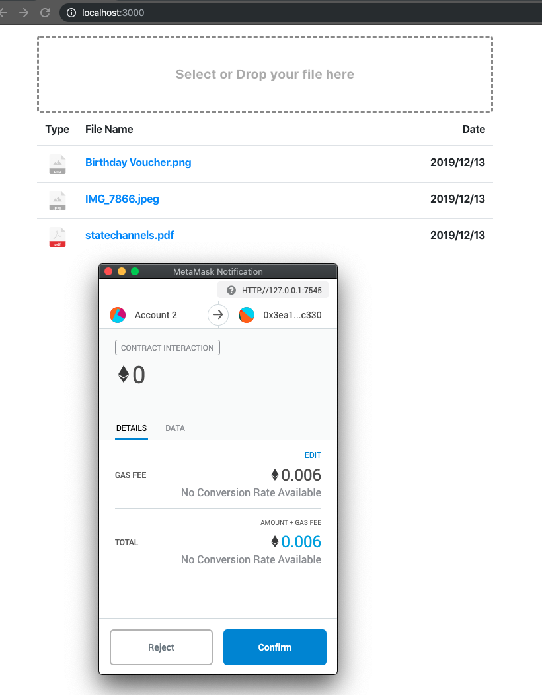

# SolidityDrive

I've created the following app in order to get familiar with Solidity, truffle, web3, and IPFS.
It's a simple drive app where files are saved in IPFS and the ethereum smart contract links the files with an account. 

The frontend displays the dropzone and the list of the files linked to each ethereum wallet. Dropping a file into the dropzone saves it in IPFS distributed storage. After that the hash, the filename, the timestamp, etc. are saved in ethereum storage smart contract which links the files with an account. On change of the account in Metamask, the frontend reloads, access the storage smart contracts and render a list of the files. On click on the file, the user is redirected to the IPFS directory with the file.

The frontend is an easy react project.

## Deployment

1. Clone the repo
2. Install [truffle](https://www.trufflesuite.com/docs/truffle/getting-started/installation)
3. Install [Ganache](https://www.trufflesuite.com/ganache) local blockchain for Ethereum
4. Start Ganache Ethereum server. It should run on localport on port 7545
5. Compile smart contracts `truffle compile`
6. Deploy the smartcontract into the local blockchain - `truffle migrate`
7. Go to client directory - `cd client`
8. instal packages - `npm install`
9. start server - `npm start`

## Interaction with the drive and smart contract

Drop the file to the dropzone.

Metamask window will appear to confirm the blockchian transaction of storing the file info in blockchian. In paralel the file is stored in IPFS.

To access the file stored in IPFS just press it and you will be redirected.

## Screenshot

